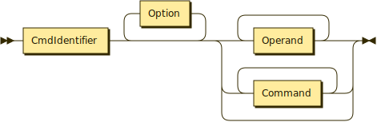
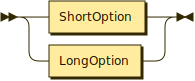
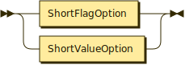
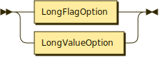
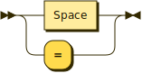
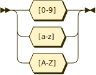
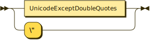
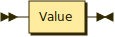

**Command:**



```
Command  ::= CmdIdentifier Option* Operand*
```

**CmdIdentifier:**


```
CmdIdentifier
         ::= Alphanumeric*
```

referenced by:

- Command

**Option:**



```
Option   ::= ShortOption
           | LongOption
```

referenced by:

- Command

**ShortOption:**



```
ShortOption
         ::= ShortFlagOption
           | ShortValueOption
```

referenced by:

- Option

**LongOption:**



```
LongOption
         ::= LongFlagOption
           | LongValueOption
```

referenced by:

- Option

**ShortFlagOption:**


```
ShortFlagOption
         ::= '-' Alphanumeric
```

referenced by:

- ShortOption

**ShortValueOption:**


```
ShortValueOption
         ::= '-' Alphanumeric OptionValueDelimiter Value
```

referenced by:

- ShortOption

**LongFlagOption:**


```
LongFlagOption
         ::= '--' Alphanumeric+
```

referenced by:

- LongOption

**LongValueOption:**


```
LongValueOption
         ::= '--' Alphanumeric+ OptionValueDelimiter Value
```

referenced by:

- LongOption

**OptionValueDelimiter:**



```
OptionValueDelimiter
         ::= Space
           | '='
```

referenced by:

- LongValueOption
- ShortValueOption

**Alphanumeric:**



```
Alphanumeric
         ::= [0-9a-zA-Z]
```

referenced by:

- CmdIdentifier
- LongFlagOption
- LongValueOption
- ShortFlagOption
- ShortValueOption

**Value:**


```
Value    ::= Char*
           | '"' ( Char | Space )* '"'
```

referenced by:

- LongValueOption
- Operand
- ShortValueOption

**Char:**



```
Char     ::= UnicodeExceptDoubleQuotes
           | '\"'
```

referenced by:

- Value

**Space:**


```
Space    ::= ( U+0020 )*
```

referenced by:

- OptionValueDelimiter
- Value

**Operand:**



```
Operand  ::= Value
```

referenced by:

- Command

##

 <sup>generated by [RR - Railroad Diagram Generator][rr]</sup>

[rr]: http://bottlecaps.de/rr/ui
